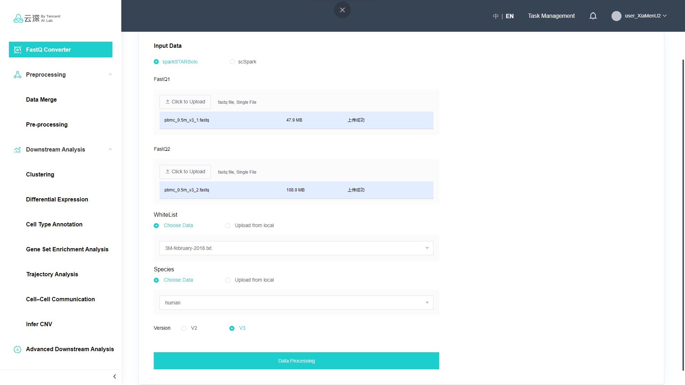

# USAIL_sparkSTARsolo

a Spark-based distributed version of STARsolo

### Environment

1. Java_1.8
2. Scala_2.12
3. Apache Spark
4. Apache Hadoop
5. Maven

### Example

#### GUI (Platform) -- Demo version



#### CMD -- Experimental version

First, set spark's environment
Next, set the parameters in run.sh and run
```shell
spark_master=spark://127.0.0.1:7077
executor_memory=64G
executor_cores=16
driver_memory=32G
total_executor_cores=64

/usr/local/service/spark/bin/spark-submit --class com.github.xmuyulab.sparkStarSolo.scStarSolo \
    --master ${spark_master} \
    --executor-memory ${executor_memory} \
    --driver-memory ${driver_memory} \
    --executor-cores ${executor_cores} \
    --total-executor-cores ${total_executor_cores} \
    /data/sparkStarSolo-1.0-SNAPSHOT-jar-with-dependencies.jar  \
    -fastqR1 pbmc_0.5m_v3_1.fastq \
    -fastqR2 pbmc_0.5m_v3_2.fastq  \
    -whitelist file:///data/3M-february-2018.txt \
    -index /data/HumanIndex \
    -libPath /data/libSolo.so \
    -runThreadN 16 \
    -soloCBstart 1 \
    -soloCBlen 16 \
    -soloUMIstart 17 \
    -soloUMIlen 12 \
    -output hdfs:///data/pbmc_human/64cores \
```
```
chmod +x run.sh
./run.sh
```

